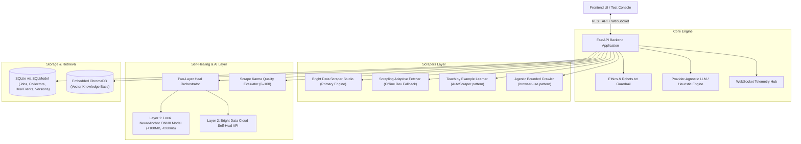
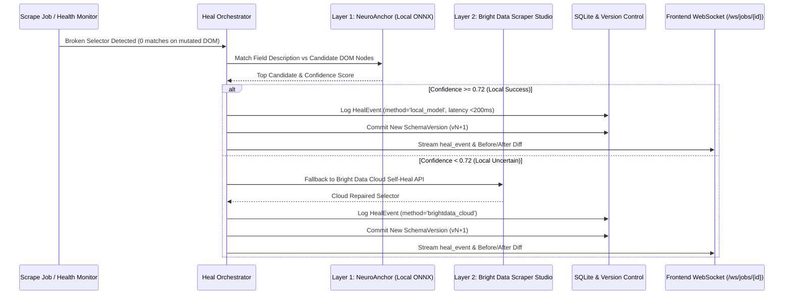

# NeuroScrape — System Architecture & Data Flow

Detailed system architecture, data flow diagrams, two-layer healing decision logic, and technical decision records.

---

## 1. High-Level Architecture Diagram

---

## 2. End-to-End Scrape Lifecycle

1. **Request & Compliance Gate**: User submits target URL and desired fields. `robots_check.py` validates `robots.txt` and rejects private/auth URL patterns.
2. **Schema Generation**: `llm.py` transforms plain English descriptions into a structured Scraper Studio field specification (with offline heuristic fallback if no LLM key is configured).
3. **Collector Provisioning**: `brightdata_client.py` provisions a Scraper Studio Collector (`c_xxxxx`) and logs initial Schema Version `v1`.
4. **Execution & Live Telemetry**: The collector runs against the target URL. Progress and logs stream live over `/ws/jobs/{job_id}`.
5. **Quality Scoring**: Scraped records pass through `karma_score.py` where NeuroAnchor embeddings + classifier head score each record (0–100) and attach quality flags.
6. **Persistence & Export**: Structured rows and Karma scores are saved in SQLite, immediately available for JSON/CSV/Markdown/RAG-chunk export or RAG indexing.

---

## 3. Two-Layer Self-Healing Decision Workflow

---

## 4. Why Technical Decisions Were Made

- **FastAPI + WebSockets**: Native async support, high concurrency, and built-in WebSocket support for real-time telemetry streaming to frontend.
- **Local NeuroAnchor Model (<100MB int8 ONNX)**: Eliminates cloud LLM API cost, avoids external network latency during DOM repairs, and guarantees offline demo reliability.
- **SQLModel / SQLite**: Zero-configuration setup for hackathon evaluation, strictly typed with Pydantic, and easily swappable with PostgreSQL in production via connection string.
- **Embedded ChromaDB**: Embedded vector database requiring no external Docker server or cloud service, enabling instant Scrape-to-RAG knowledge indexing.
- **Simulate Site Change Endpoint**: Programmatically mutates class names and DOM structures on saved snapshots, enabling guaranteed live self-healing demonstrations on stage.
